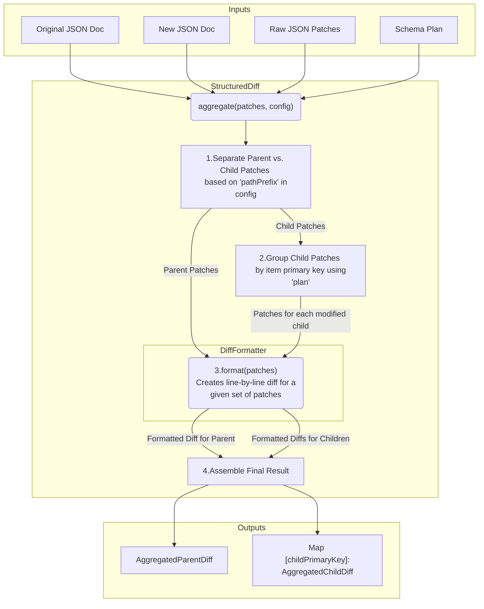

# JSON Diff Formatting and Aggregation

This directory contains the logic for formatting and aggregating JSON patches into human-readable diffs. This is especially useful for visualizing changes in complex, nested JSON structures, such as configuration files or API responses.

The system is composed of two main components: `StructuredDiff` and `DiffFormatter`.

## Core Components

### `StructuredDiff.ts`

When comparing two JSON documents, especially those with arrays of objects, changes can be scattered across many individual patches. For example, modifying three different items in an array will produce patches for each of those items. `StructuredDiff` is designed to make sense of these changes by grouping them logically.

- It operates on a specific array within the JSON document, identified by a `pathPrefix`.
- It uses a primary key from the schema (`plan`) to identify unique objects within the array.
- It separates patches into two categories:
  - **Parent Patches**: Changes that apply to the document outside of the specified array.
  - **Child Patches**: Changes that apply to items within the array. These are further grouped by the item's unique ID.

The result is a structured view that presents a high-level summary of what changed in the parent, and a detailed breakdown of changes for each affected child item (e.g., "User with id=X was changed").

### `DiffFormatter.ts`

Once patches are grouped by `StructuredDiff`, `DiffFormatter` is responsible for creating a visual representation of the changes.

- It takes a JSON object (or a pair: original and new) and the patches that apply to it.
- It generates a pretty-printed, line-by-line, side-by-side diff.
- It intelligently maps the JSON patch paths (e.g., `/users/0/name`) to specific line numbers in the formatted JSON output.
- Lines that are added, removed, or unchanged are marked accordingly, making it easy to see the exact modifications.
- It includes performance optimizations like caching of formatted diffs and path maps.

## Processing Flow

The following diagram illustrates how raw JSON patches are processed to produce aggregated and formatted diffs. The process starts with the original and new JSON documents and a list of patches. `StructuredDiff` orchestrates the process, using `DiffFormatter` to generate the final output.

