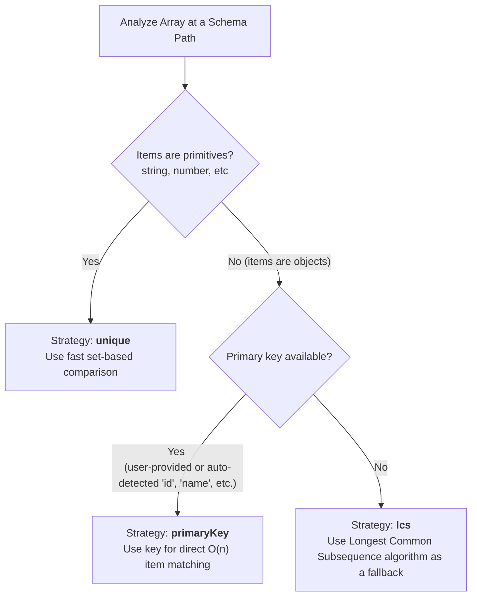

# Schema-based Diffing Optimizations: The Build Plan

The `buildPlan.ts` module is central to the performance of this JSON diffing library. By leveraging the JSON schema *before* the diffing process begins, we can create a highly optimized "plan" that accelerates comparisons, particularly for arrays, which are often the most computationally intensive part of diffing.

This document outlines the optimizations enabled by the `buildPlan` function.

## The Core Idea: Pre-computation

The `buildPlan` function traverses a given JSON schema and produces a `Plan`. This `Plan` is a map where keys are JSON pointers (paths to arrays in a document, like `/users` or `/users/posts`) and values are `ArrayPlan` objects. Each `ArrayPlan` contains pre-computed information and a tailored strategy for diffing its corresponding array.

This pre-computation means that during the actual diff, the algorithm doesn't need to re-analyze the schema or guess the structure of the data. It can simply look up the path of an array in the `Plan` and use the optimal, pre-determined strategy.

## 1. Strategic Array Diffing

A significant optimization comes from selecting the most efficient algorithm for comparing two versions of an array. The `buildPlan` function inspects the schema of array items to choose one of three strategies.

### Strategies

-   **`primaryKey` (Most performant)**: When array items are objects, the most efficient way to match them is via a unique identifier. The `buildPlan` function looks for common primary key fields (`id`, `name`) in the object schema or uses a key explicitly provided by the user. This reduces the comparison from a potentially O(n*m) problem to a much faster O(n) key-based lookup.

-   **`unique`**: For arrays of primitive values (like a list of tags or numbers), we can treat the array as a set of unique items. This allows for a very fast, set-based diff to find additions and deletions.

-   **`lcs` (Fallback)**: For arrays of complex objects that lack a primary key, we fall back to the Longest Common Subsequence (LCS) algorithm. While robust, it's more computationally expensive than the other strategies. The goal of the `buildPlan` is to avoid this strategy whenever possible.

## 2. Hashing for Quick Equality Checks

When using the `primaryKey` strategy, we still need to check if a matched item has been modified. A deep equality check on two objects can be slow. To optimize this, the `buildPlan` identifies a set of `hashFields` for object schemas.

-   **How it works**: These fields are typically required, primitive properties of the object (e.g., `name`, `type`, `status`).
-   **The optimization**: During the diff, we can compute a quick hash from the values of these fields for both the old and new object. If the hashes differ, we know the object has changed and can mark it as modified without performing a full, deep comparison. If the hashes are the same, we then proceed with a deep comparison, but this initial check helps to quickly rule out a large number of expensive comparisons.

## 3. One-time Schema Processing

The `buildPlan` also handles schema-related tasks upfront to avoid repetitive work during the diff.

-   **`$ref` Resolution**: JSON schemas often use `$ref` to point to other parts of the schema. These references are resolved once when the plan is built, and the resolved sub-schema is cached within the `ArrayPlan`.
-   **Metadata Caching**: Information like `requiredFields` is extracted and stored in the plan, making it readily available for validation or other checks during the diffing process without needing to inspect the schema again.

By combining these strategies, the `buildPlan` ensures that the diffing engine is armed with the most efficient methods and pre-computed data, tailored specifically to the shape of the JSON documents it will be comparing. 